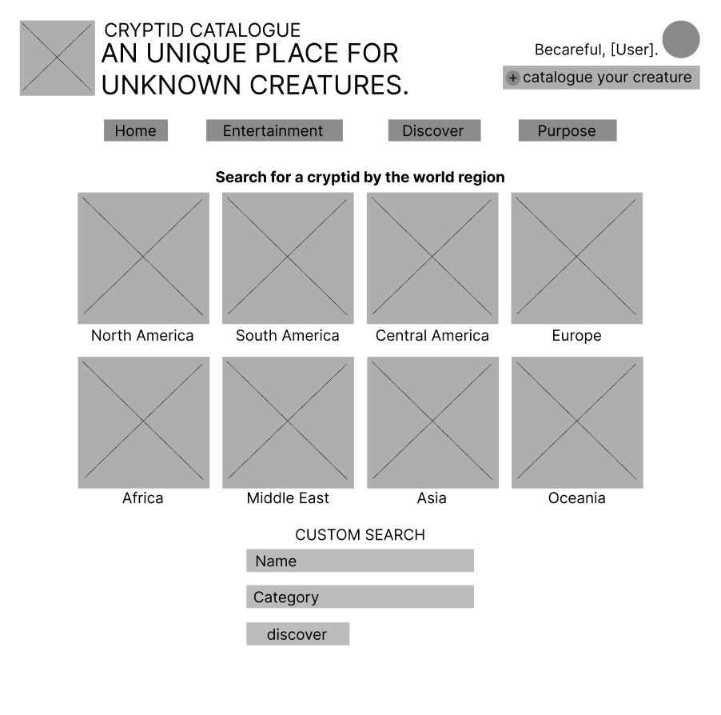
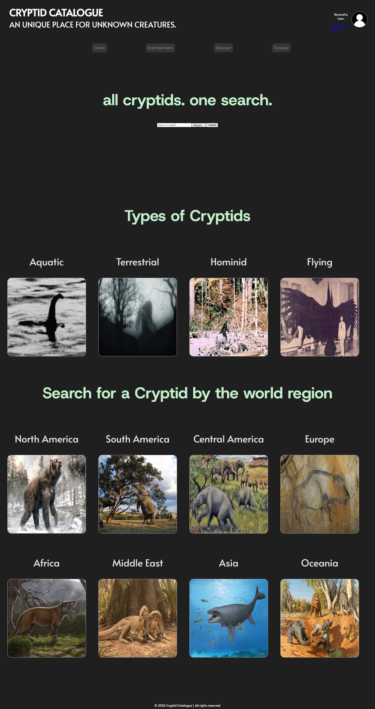
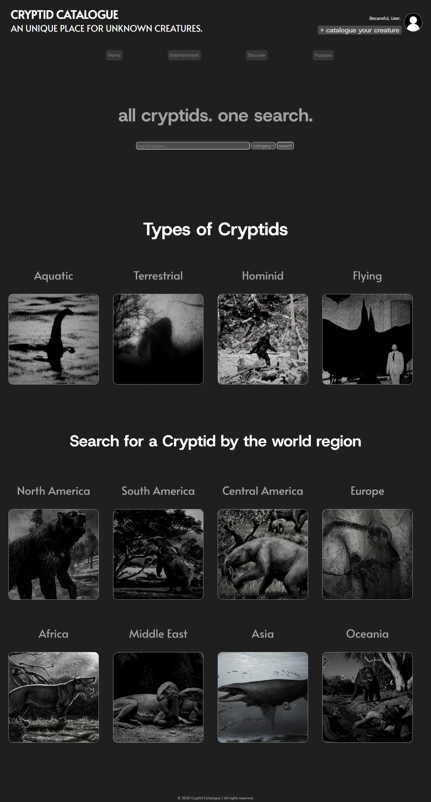

# CRYPTID CATALOGUE WEB PROJECT

## Nome: Matheus Henrique Lopes de Aquino

## Matrícula: 927905

### Base do Projeto

Para esse projeto, escolhi desenvolver um web site que possui como núcleo de conteúdo a entidade primária de coleção (Criptídeos) e a entidade secundária (categorias de criptídeos), ou seja, o núcleo "coleções e itens".

### Objetivo do Projeto

Esse projeto tem o intuito de ser um ambiente descentralizado, no qual a própria comunidade que se interessa pelo assunto de criptídeos e pseudociência digital constrói e mantém o acervo do Cryptid Catalogue, além de participar de melhorias, de blogs e de jogos relacionados ao assunto na própria web page.  

### Wireframe

### Página Criada V1

### Página Criada V2    

